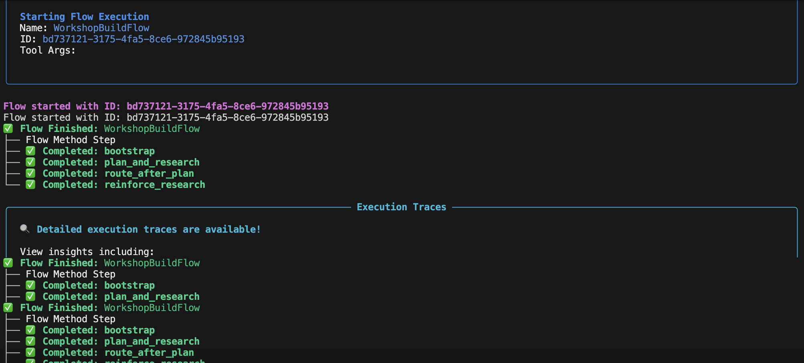
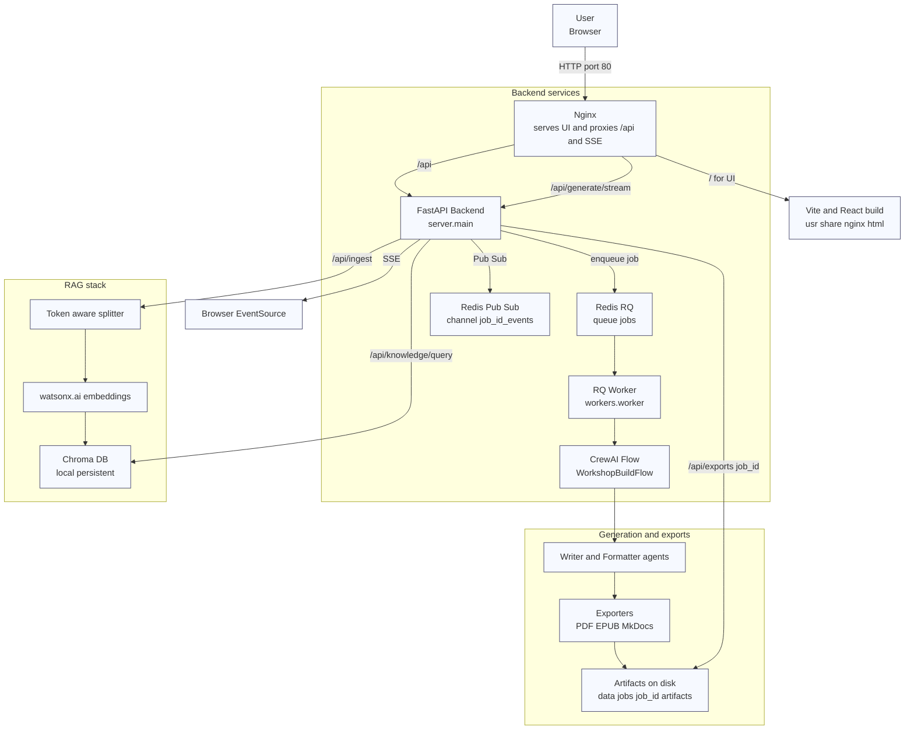

<div align="center">
  <h1>🧠 Workshop Builder</h1>
  <p><b>FastAPI + watsonx.ai + RAG (Chroma) + CrewAI Flows</b><br/>Agentic document generation — workshops, books, guides.</p>
  <p>
    
    
    
  </p>
</div>

---


> Production-ready, batteries included: background jobs with Redis/RQ (SSE streaming), multi-tenant auth, watsonx.ai models, and a modern Vite/React UI. Run locally or with Docker Compose (API + Worker + Redis + Nginx).

---

## ✨ What it does

**Workshop Builder** turns raw materials (Markdown, docs, repos, web pages) into polished **workshops** and **long-form documents** via an agentic pipeline:

* **CrewAI Flows**: planner → researcher → writer → formatter → exporter
* **watsonx.ai**: Granite/LLM for drafting + embeddings
* **RAG**: token-aware chunking & retrieval with **Chroma**
* **FastAPI**: secure backend + **SSE** streaming (progress/logs/artifacts)
* **Redis/RQ**: reliable background jobs (queue: `jobs`)

**Outputs:** `PDF`, `EPUB`, `MkDocs` site (zipped artifacts via `/api/exports/{job_id}`).

---

## 🚀 Quick start (local dev)

```bash
# 1) Setup Python env (3.11+ recommended)
make check-uv
make install
cp .env.example .env   # fill watsonx.ai creds: API key, project id, region
```

```bash
# 2) Run backend + frontend together (hot reload)
make run
# Backend:  http://localhost:5000
# Frontend: http://localhost:5173
```

```bash
# 3) Smoke test end-to-end (ingest -> generate -> stream -> artifacts)
python examples/test_workshop.py --download
```

> Only want the API?
> `uv run uvicorn server.main:app --host 0.0.0.0 --port 5000 --reload`

---

## 🐳 Production with Docker Compose

The infra bundle runs **API**, **Worker**, **Redis**, and **Nginx** (serves UI + proxies `/api` & SSE).

```bash
# Build images (auto-detects 'docker compose' v2 or 'docker-compose' v1)
make build-infra

# Start stack in background
make run-infra

# Tail logs (all services)
make monitor-infra

# Stop & clean up
make stop-infra
```

URLs:

* UI → `http://localhost/`
* API → `http://localhost/api`
* SSE → proxied at `/api/generate/stream`

> Compose files live under `infra/`. See `infra/docker-compose.yml`, `infra/Dockerfile`, `infra/Dockerfile.nginx`, `infra/nginx.conf`.

---

## 🔐 Auth & tenancy

Simple, production-friendly defaults:

* **API key** (dev): send `X-API-Key: dev-key-123`
* **Tenant** header: `X-Tenant-Id: public`

You can switch to **JWT** (HS256 or JWKS) in settings if desired.

---

## 🧩 API overview

| Method | Endpoint                        | Purpose                                   |
| -----: | ------------------------------- | ----------------------------------------- |
|    GET | `/api/healthz`                  | Liveness                                  |
|    GET | `/api/readyz`                   | Readiness                                 |
|    GET | `/api/metrics`                  | Prometheus metrics                        |
|   POST | `/api/ingest/files`             | Multipart ingest                          |
|   POST | `/api/ingest/github`            | JSON ingest `{files:[{path,title,text}]}` |
|   POST | `/api/knowledge/query`          | RAG query                                 |
|   POST | `/api/generate/start`           | Start background job                      |
|    GET | `/api/generate/stream?job_id=…` | **SSE** progress/logs/artifacts           |
|    GET | `/api/exports/{job_id}`         | List/download artifacts                   |

**Headers (dev defaults):**

```
X-API-Key: dev-key-123
X-Tenant-Id: public
```

---

## ⚙️ Key settings (.env)

Create `.env` from `.env.example` and fill the watsonx.ai credentials:

```ini
# App
PORT=5000
LOG_LEVEL=INFO
STATIC_ROOT=./ui/dist

# Redis/RQ
REDIS_URL=redis://localhost:6379/0
RQ_QUEUE=jobs

# Storage
DATA_DIR=./data
JOBS_DIR=./data/jobs
CHROMA_DIR=./data/chroma

# Auth / Tenancy
API_KEY=dev-key-123
TENANT=public

# Crew LLM selection
CREW_PROVIDER=watsonx  # or: openai | ollama

# watsonx.ai (REQUIRED for CREW_PROVIDER=watsonx)
WATSONX_APIKEY=...                # alias required by some libs
WATSONX_API_KEY=...               # same value as above
WATSONX_URL=https://us-south.ml.cloud.ibm.com
WATSONX_PROJECT_ID=...
WATSONX_REGION=us-south
WATSONX_CHAT_MODEL=meta-llama/llama-3-3-70b-instruct
WATSONX_EMBED_MODEL=ibm/text-embedding-001

# Generation defaults
CREW_TEMPERATURE=0.2

# (Optional) OpenAI
# OPENAI_API_KEY=...
# OPENAI_MODEL=gpt-4o-mini

# (Optional) Ollama
# OLLAMA_HOST=http://localhost:11434
# OLLAMA_MODEL=llama3.1
```

> In Docker Compose, services use `REDIS_URL=redis://redis:6379/0`.
> On macOS local dev (outside Docker), the worker script uses a **SimpleWorker** to avoid Obj-C `fork()` issues.

---

## 🔄 Job pipeline & SSE streaming

1. **Enqueue**
   `POST /api/generate/start` places a job on Redis queue `jobs` and returns `{ job_id, stream }`.

2. **Process**
   RQ worker runs the CrewAI Flow and publishes events to Redis Pub/Sub channel `job:{job_id}:events`.

3. **Stream**
   `GET /api/generate/stream?job_id=...` subscribes and streams live **SSE** events:

   * `progress` → `{ pct, msg }`
   * `log` → `{ level, msg }`
   * `artifact` → `{ type, label, path, filename, size }`
   * `done` → `{ ok, artifacts? }`

4. **Export**
   Artifacts are persisted under the job’s artifact folder and listed via `/api/exports/{job_id}`.

Cancel: `POST /api/generate/cancel` with `{ "job_id": "…" }`.

---

## 🧠 RAG & embeddings

* **Splitter:** `RecursiveCharacterTextSplitter` (≈1200 tokens, 160 overlap; tune to your corpus)
* **Vector DB:** Chroma (`cosine` similarity)
* **Embeddings:** watsonx.ai (`ibm/text-embedding-001` recommended)

  > If you use `ibm/slate-125m-english-rtrvr`, keep chunks ≤ 510 tokens (model max 512 incl. BOS/EOS).

---

## 🤖 CrewAI Flows (how it works)

The project uses **CrewAI Flows** for deterministic, observable, multi-agent orchestration with typed state and conditional routing.



### Why Flows?

* **Structured state** with Pydantic (e.g., `WorkshopState`)
* **Explicit steps** with decorators: `@start`, `@listen`, `@router`, `or_(...)`
* **Conditional routing** (“high/medium/low confidence” branches)
* **LLM injection** so agents never “guess” a provider


## 🧰 Dev & Ops commands

**Makefile (cross-platform):**

* Python: `make install`, `make run`, `make run-api`, `make ui-dev`, `make test`, `make lint`, `make fmt`
* Infra: `make build-infra`, `make run-infra`, `make monitor-infra`, `make stop-infra`

**Redis & worker (local only):**

```bash
bash scripts/redis_up.sh     # start local Redis container
bash scripts/rq_worker.sh    # attach worker (uses SimpleWorker on macOS)
```

## Architercutre


---

## 🛡️ Production notes

* **Nginx** terminates HTTP, serves the Vite build, and proxies `/api` + SSE with buffering **disabled**.
* **Gunicorn** (`WEB_CONCURRENCY`) defaults to `cpu_count()` workers; tune per CPU/RAM.
* **Security:** rotate API keys, prefer JWT/JWKS, set strict CORS, and run behind TLS.
* **Observability:** `/metrics` for Prometheus; optional OpenTelemetry exporters.
* **Persistence:** mount volumes for Redis data and `data/` if you need durable artifacts.

---

## 🧯 Troubleshooting

* **“OPENAI_API_KEY is required”**
  You’re hitting CrewAI’s default provider. Ensure:

  * `CREW_PROVIDER=watsonx` (or your target),
  * `WATSONX_APIKEY` & `WATSONX_API_KEY` set (same value),
  * Flow agents are created with `llm=self.llm`.

* **LiteLLM fallback error**
  Means a non-native LLM object slipped in. Use our `build_crewai_llm` and pass `llm=` into every `Agent` and `Crew`.

* **macOS Obj-C `fork()` crash**
  Use `rq.worker.SimpleWorker` or run inside Docker (forked is fine on Linux). Our local worker script handles this.

* **watsonx embeddings 512-token limit**
  Keep chunk size ≤ 510 tokens for `ibm/slate-125m-english-rtrvr`, or use `ibm/text-embedding-001`.

---

## 🧾 License

**Apache-2.0** — see `LICENSE`.

---

## 🙌 Credits

* **IBM watsonx.ai** Granite models
* **CrewAI** orchestration
* **FastAPI**, **Chroma**, **Vite/React**, **Redis/RQ**
