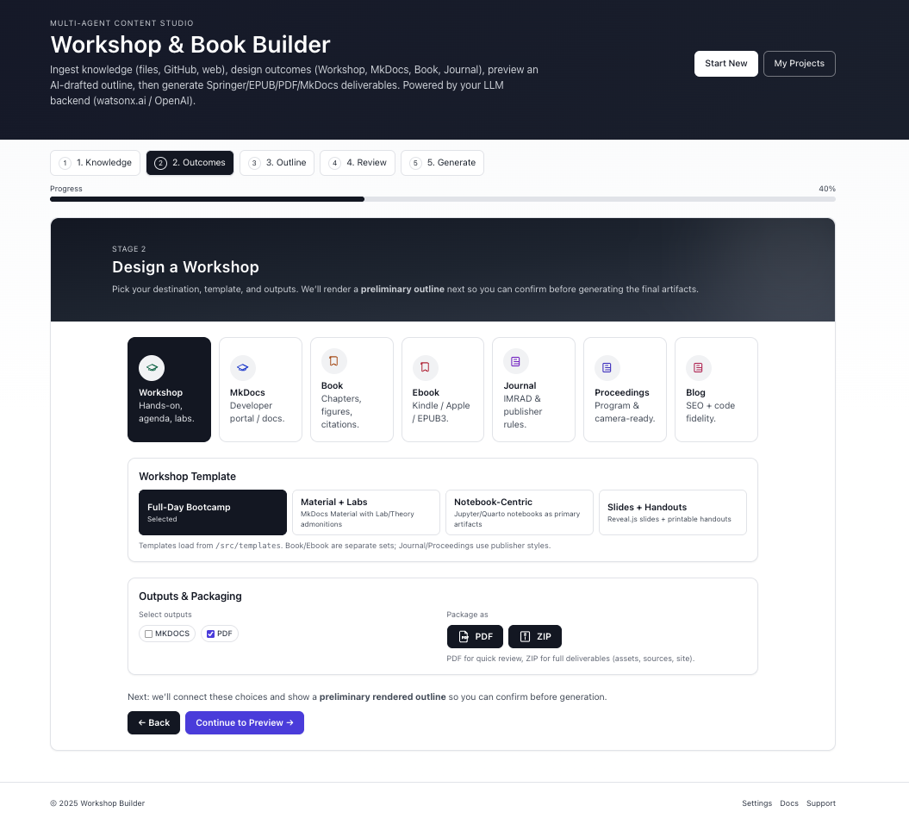

<div align="center">
  <h1>🧠 Workshop Builder</h1>
  <p><b>FastAPI + watsonx.ai + RAG (Chroma) + CrewAI</b><br/>Agentic document generation — workshops, books, guides.</p>
  <p>
    
    
    
  </p>
</div>

---



> Production-ready, batteries-included: background jobs with Redis/RQ (SSE streaming), multi-tenant auth, watsonx.ai models, and a modern Vite/React UI. Run locally or with Docker Compose (API + Worker + Redis + Nginx).

---

## ✨ What it does

**Workshop Builder** turns raw materials (Markdown, docs, repos, web pages) into polished **workshops** and **long-form documents** via an agentic pipeline:

- **CrewAI**: planner → researcher → writer → formatter → exporter  
- **watsonx.ai**: Granite/LLM for drafting + embeddings  
- **RAG**: token-aware chunking & retrieval with **Chroma**  
- **FastAPI**: secure backend + **SSE** streaming (progress/logs/artifacts)  
- **Redis/RQ**: reliable background jobs (queue: `jobs`)  

**Outputs:** `PDF`, `EPUB`, `MkDocs` site (zipped artifacts via `/api/exports/{job_id}`).

---

## 🚀 Quick start (local dev)

```bash
# 1) Setup Python env (3.11+ recommended)
make check-uv
make install
cp .env.example .env   # fill watsonx.ai creds: API key, project id, region
````

```bash
# 2) Run backend + frontend together (hot reload)
make run
# Backend:  http://localhost:5000
# Frontend: http://localhost:5173
```

```bash
# 3) Smoke test end-to-end (ingest -> generate -> stream -> artifacts)
python examples/test_workshop.py --download
```

> Only want the API?
> `uv run uvicorn server.main:app --host 0.0.0.0 --port 5000 --reload`

---

## 🐳 Production with Docker Compose

The infra bundle runs **API**, **Worker**, **Redis**, and **Nginx** (serves UI + proxies `/api` & SSE).

```bash
# Build images (auto-detects 'docker compose' v2 or 'docker-compose' v1)
make build-infra

# Start stack in background
make run-infra

# Tail logs (all services)
make monitor-infra

# Stop & clean up
make stop-infra
```

URLs:

* UI → `http://localhost/`
* API → `http://localhost/api`
* SSE → proxied at `/api/generate/stream`

> Compose files live under `infra/`. See `infra/docker-compose.yml`, `infra/Dockerfile`, `infra/Dockerfile.nginx`, `infra/nginx.conf`.

---

## 🔐 Auth & tenancy

Simple, production-friendly defaults:

* **API key** (default dev): send `X-API-Key: dev-key-123`
* **Tenant** header: `X-Tenant-Id: public`

You can switch to **JWT** (HS256 or JWKS) in settings if desired.

---

## 🧩 API overview

| Method | Endpoint                        | Purpose                                   |
| -----: | ------------------------------- | ----------------------------------------- |
|    GET | `/api/healthz`                  | Liveness                                  |
|    GET | `/api/readyz`                   | Readiness                                 |
|    GET | `/api/metrics`                  | Prometheus metrics                        |
|   POST | `/api/ingest/files`             | Multipart ingest                          |
|   POST | `/api/ingest/github`            | JSON ingest `{files:[{path,title,text}]}` |
|   POST | `/api/knowledge/query`          | RAG query                                 |
|   POST | `/api/generate/start`           | Start background job                      |
|    GET | `/api/generate/stream?job_id=…` | **SSE** progress/logs/artifacts           |
|    GET | `/api/exports/{job_id}`         | List/download artifacts                   |

**Headers (dev defaults):**

```
X-API-Key: dev-key-123
X-Tenant-Id: public
```

---

## ⚙️ Key settings (.env)

Create `.env` from `.env.example` and fill the watsonx.ai credentials:

```ini
# App
PORT=5000
LOG_LEVEL=INFO
STATIC_ROOT=./ui/dist

# Redis/RQ
REDIS_URL=redis://localhost:6379/0
RQ_QUEUE=jobs

# Storage
DATA_DIR=./data
JOBS_DIR=./data/jobs
CHROMA_DIR=./data/chroma

# Auth / Tenancy
API_KEY=dev-key-123
TENANT=public

# watsonx.ai (REQUIRED)
WATSONX_API_KEY=...
WATSONX_PROJECT_ID=...
WATSONX_REGION=us-south
WATSONX_CHAT_MODEL=meta-llama/llama-3-3-70b-instruct
WATSONX_EMBED_MODEL=ibm/text-embedding-001
```

> In Docker Compose, services use `REDIS_URL=redis://redis:6379/0`. The worker uses the **forked** RQ worker class by default (production). For macOS local development outside Docker we use a **SimpleWorker** to avoid Obj-C `fork()` issues.

---

## 🔄 Redis/RQ pipeline (SSE streaming)

* **Enqueue:** `POST /api/generate/start` → puts `run_job_worker(...)` on Redis queue `jobs`.
* **Process:** RQ worker consumes tasks, runs the agentic pipeline, and publishes events to Redis Pub/Sub channel `job:{job_id}:events`.
* **Stream:** `GET /api/generate/stream?job_id=...` subscribes to Pub/Sub and streams events (`progress`, `log`, `artifact`, `done`) to the browser via **SSE**.

Cancel is supported via `POST /api/generate/cancel { job_id }` (sets `job:{id}:cancel` key with TTL).

---

## 🧠 RAG & Agents (defaults)

* **Splitter:** Recursive chars (`chunk_size≈1200`, `overlap≈160`)
* **Vector DB:** Chroma (cosine similarity)
* **Embeddings:** watsonx.ai (e.g., `ibm/text-embedding-001`)
* **CrewAI roles:** Planner → Researcher → Writer → Formatter → Exporter
* **Exports:** creates `pdf`, `epub`, `mkdocs` artifacts and emits them over SSE.

---

## 🧰 Dev & Ops commands

**Makefile (cross-platform):**

* Python: `make install`, `make run`, `make run-api`, `make ui-dev`, `make test`, `make lint`, `make fmt`
* Infra: `make build-infra`, `make run-infra`, `make monitor-infra`, `make stop-infra`

**Redis & worker (local only):**

```bash
bash scripts/redis_up.sh     # start local Redis container
bash scripts/rq_worker.sh    # attach worker (uses SimpleWorker on macOS)
bash scripts/redis_tests.sh  # smoke test ping + RQ job
```

---

## 🛡️ Production notes

* **Nginx** terminates HTTP, serves the Vite build, and proxies `/api` + SSE with buffering **disabled**.
* **Gunicorn** (`WEB_CONCURRENCY`) defaults to `cpu_count()` workers; tune per CPU/RAM.
* **Security:** rotate API keys, prefer JWT/JWKS, set strict CORS, run behind TLS.
* **Observability:** `/metrics` for Prometheus; optional OpenTelemetry exporters.
* **Persistence:** mount volumes for Redis data and `data/` if you need durable artifacts.

---

## 🧯 Troubleshooting

* **Compose v1 vs v2:** The Makefile auto-detects `docker compose` (v2) vs `docker-compose` (v1).
* **Setuptools package discovery:** `pyproject.toml` restricts discovery to `server*` & `workers*` to avoid packaging UI & infra.
* **macOS Obj-C `fork()` crash:** local worker script uses `rq.worker.SimpleWorker` and sets `OBJC_DISABLE_INITIALIZE_FORK_SAFETY=YES` (inside Docker/Linux we use the default forked worker).
* **watsonx.ai 400 “max sequence length”**: we chunk input conservatively; if you change models, adjust splitter size/overlap accordingly.

---

## 🧾 License

**Apache-2.0** — see `LICENSE`.

---

## 🙌 Credits

* **IBM watsonx.ai** Granite models
* **CrewAI** orchestration
* **FastAPI**, **Chroma**, **Vite/React**, **Redis/RQ**

