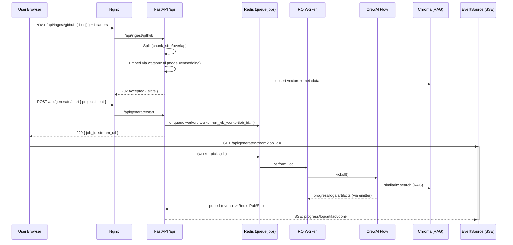
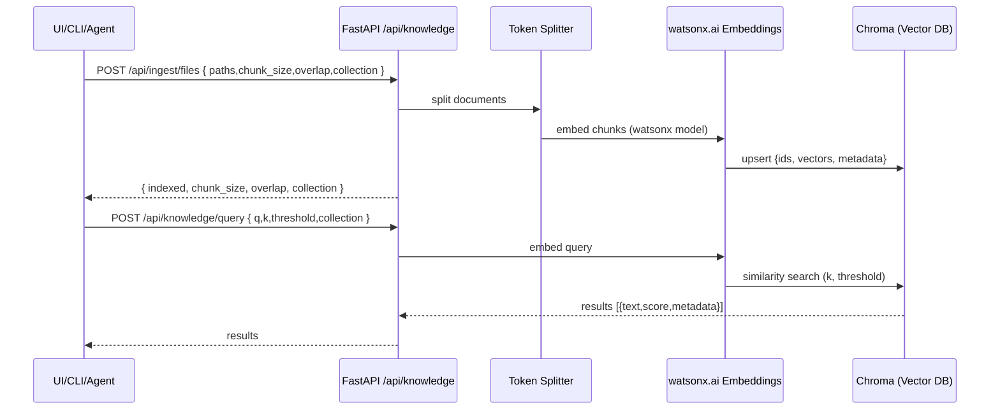
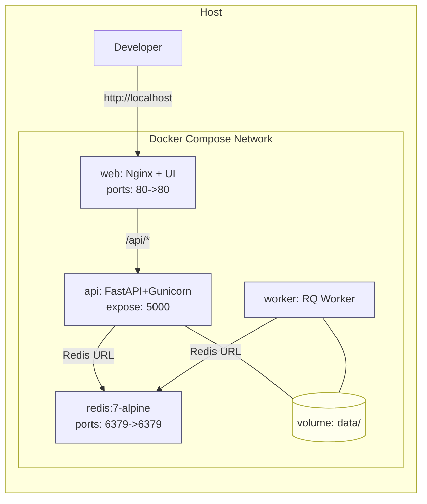

Current stack (FastAPI API, Vite/React UI via Nginx, Redis/RQ worker, CrewAI Flows, watsonx.ai LLM+embeddings, Chroma, SSE streaming).

---

## 1) High-level architecture

```mermaid
flowchart LR
    U[User<br/>Browser] -->|HTTP 80| NX[Nginx<br/>serves UI & proxies /api/* & SSE]
    NX -->|/api/*| API[FastAPI Backend<br/>server.main]
    NX -->|/ (UI)| UI[Vite/React Build<br/>/usr/share/nginx/html]

    subgraph SVC[Backend Services]
      API -->|enqueue job| RQ[Redis RQ<br/>queue: jobs]
      RQ --> WK[RQ Worker<br/>workers.worker]
      WK --> FL[⚙️ CrewAI Flow<br/>WorkshopBuildFlow]
      API -->|Pub/Sub| RS[Redis Pub/Sub<br/>job:{id}:events]
      NX -->|/api/generate/stream| API
      API -->|SSE| BR[Browser EventSource]
    end

    subgraph RAG[RAG Stack]
      SP[Token-aware Splitter] --> EMB[watsonx.ai Embeddings]
      EMB --> CH[Chroma DB<br/>local persistent]
      API -->|/api/ingest/*| SP
      API -->|/api/knowledge/query| CH
    end

    subgraph GEN[Generation & Exports]
      FL --> WR[Writer/Formatter Agents]
      WR --> EXP[Exporters<br/>PDF • EPUB • MkDocs]
      EXP --> FS[Artifacts on Disk<br/>/data/jobs/{id}/artifacts]
      API -->|/api/exports/{id}| FS
    end

    classDef node fill:#f6f9ff,stroke:#557;
    class U,NX,API,UI,RQ,WK,FL,RS,SP,EMB,CH,WR,EXP,FS,BR node;
```

---

## 2) Sequence — Ingest & Generate (API + Worker + SSE)



---

## 3) Sequence — /knowledge ingest & query (RAG)



---

## 4) Deployment topology (docker-compose)



---

## 5) Data lifecycle — from sources to artifacts

```mermaid
flowchart TB
    SRC[Sources<br/>Markdown • Docs • Web/Repo JSON] --> ING[Ingest API]
    ING --> SPLIT[Token-aware Splitter]
    SPLIT --> EMB[watsonx.ai Embeddings]
    EMB --> CH[Chroma<br/>persisted collection]
    CH --> RAG[RAG Retrieval<br/>top-k contexts]
    RAG --> PLAN[Planner/Researcher (CrewAI)]
    PLAN --> WRITE[Writer/Formatter (CrewAI)]
    WRITE --> MS[Manuscript.md]
    MS --> EXP[Exporters<br/>PDF • EPUB • MkDocs]
    EXP --> ART[Artifacts on Disk<br/>/data/jobs/{id}/artifacts]
    ART --> DL[Downloads via /api/exports/{id}]
```

---

## 6) Config & control plane

```mermaid
flowchart LR
    ENV[.env / env vars] --> CFG[Pydantic Settings]
    CFG --> LLM[LLM Builder<br/>CREW_PROVIDER=watsonx|openai|ollama]
    CFG --> API[FastAPI App]
    LLM --> Flow[WorkshopBuildFlow (CrewAI)]
    API --> Q[Redis Queue (RQ)]
    Q --> Worker[RQ Worker]
    Worker --> Flow

    ENV --> Make[Makefile Targets]
    Make -->|local| DevRun[make run / ui-dev]
    Make -->|prod| Compose[make build-infra / run-infra]

    API --> Obs[Metrics / Logs / Traces]
    Obs --> Prom[Prometheus / OTEL]
```

These reflect your **current** design: FastAPI backend, Nginx front, Redis/RQ, **CrewAI Flows** with explicitly injected LLM (watsonx.ai by default), **Chroma** for vectors, and **SSE** for realtime progress + artifacts.
